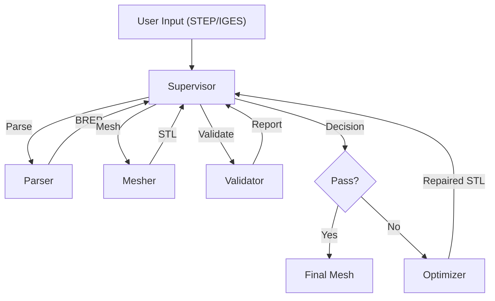

# ACMS: Automated CAD-to-Mesh System

This is the full implementation of the ACMS architecture described in the paper. It uses `pythonOCC`, `gmsh`, and `trimesh` to perform closed-loop CAD-to-mesh conversion.

## Prerequisites

You need a Python environment with the following libraries. We recommend using `conda` or `mamba` because `pythonOCC` and `gmsh` have binary dependencies.

```bash
conda create -n acms_env python=3.9
conda activate acms_env
conda install -c conda-forge gmsh trimesh numpy scipy networkx
```

## Supported Formats

> [!IMPORTANT]
> **ACMS requires universal CAD formats.**
> Proprietary formats like `.SLDPRT` (SolidWorks), `.CATPart` (CATIA), or `.IPT` (Inventor) are **NOT** supported directly.
> Please export your models to **STEP** (`.stp`, `.step`) or **IGES** (`.igs`) before using this system.

## Structure

- `main.py`: CLI entry point.
- `core/supervisor.py`: The central orchestration logic (Algorithm 1).
- `agents/`:
    - `parser.py`: Loads STEP files using Gmsh (OpenCASCADE backend).
    - `mesher.py`: Generates meshes using Gmsh.
    - `validator.py`: Checks mesh quality using Trimesh.
    - `optimizer.py`: Repairs/Optimizes meshes using Trimesh/Gmsh.

## System Architecture



## Usage

Run the system on a STEP file:

```bash
python main.py path/to/your/model.step
```

The system will:
1.  Parse the STEP file.
2.  Generate an initial mesh.
3.  Validate the mesh.
4.  If validation fails, it will iteratively repair/optimize until success or max iterations.
5.  Artifacts are saved in the `workspace/` directory.

## Testing and Analysis

ACMS includes a comprehensive batch testing and analysis suite.

### 1. Batch Testing

To test the system on multiple files at once:

1.  Place your STEP files in: `tests/CAD files/`
2.  Run the batch test script:
    ```bash
    python tests/run_batch_test.py
    ```

**Outputs:**
- **Final Meshes**: Saved in `tests/Mesh results/` (e.g., `model_final.stl`).
- **Numerical Data**: Saved in `tests/numerical_results.csv`.

### 2. Analysis and Plotting

To generate academic figures from the batch test results:

1.  Ensure you have `matplotlib`, `pandas`, and `seaborn` installed:
    ```bash
    pip install matplotlib pandas seaborn
    ```
2.  Run the analysis script:
    ```bash
    python tests/analyze_batch_results.py
    ```

**Outputs:**
- **Figures**: Saved in `tests/figures/`.
    - `fig1_success_rate.png`: Success vs. Failure pie chart.
    - `fig2_time_distribution.png`: Processing time histogram.
    - `fig3_complexity_vs_time.png`: Scatter plot of mesh complexity vs. time.
    - `fig4_failure_causes.png`: Bar chart of failure reasons.

### File Locations Summary

| Component | Location | Description |
| :--- | :--- | :--- |
| **Input CAD** | `tests/CAD files/` | Place your `.step` or `.stp` files here. |
| **Output Meshes** | `tests/Mesh results/` | Successfully generated STL files. |
| **Raw Data** | `tests/numerical_results.csv` | CSV containing metrics for all processed files. |
| **Figures** | `tests/figures/` | Generated plots for academic papers. |
| **Workspace** | `workspace/` | Temporary intermediate files (cleared per run). |

## License

MIT
